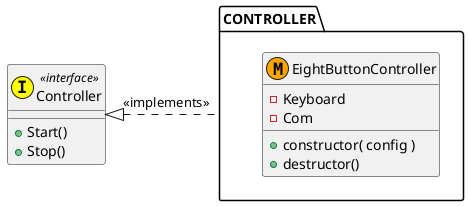

# Controller

Dependencies: `lkeyboard` `lcom` `lpthread` `lrt`  
Includes: `controller.h` `eight_button_controller.h`


## How to Build

```sh
$ sudo ./mk.sh
#snip
$ ls /home/lib
libcontroller.a
$ ls /home/include
controller.h ...
```


## Design




## Usage

```c
#include <stdio.h>
#include <string.h>

#include <mqueue_com.h>
#include <eight_button_controller.h>
#include <controller.h>

static const char * const MQNAME = "/msgqueue";
static const char * const KBPATH = "/dev/input/event2";

int main( void )
{
    /* Create instance. */
    Com *pCom = __new__MqueueCom( MQNAME );
    EightButtonControllerConfig config = {
        .pCom              = pCom,
        .pKeyboardPathname = KBPATH,
        .keyConfig         = {
            .a     = KEY_M,
            .b     = KEY_K,
            .x     = KEY_J,
            .y     = KEY_I,
            .right = KEY_S,
            .left  = KEY_A,
            .up    = KEY_W,
            .down  = KEY_Z,
        },
    };
    Controller *pController = __new__EightButtonController( &config );

    /* Receive controller data. */
    pController->Start( pController );
    while ( 1 ) {
        EightButtonControllerData data;
        memset( &data, 0, sizeof(data) );

        pCom->Read( pCom, data.aBulk, sizeof(data) );
        /* Press <A> (KEY_M) to break. */
        if ( data.field.a == 1 ) {
            printf( "\n <A> is pressed.\n" );
            break;
        };
    }
    pController->Stop( pController );

    /* Delete instance. */
    pController = __del__EightButtonController( pController );
    pCom = __del__MqueueCom( pCom );

    return 0;
}
```
