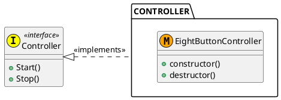

# Controller

Dependencies: `lkeyboard, lpthread`  
Includes: `controller.h`


## How to Build

```sh
$ sudo ./mk.sh
#snip
$ ls /home/lib
libcontroller.a
$ ls /home/include
controller.h
```


## Design




## Usage

```c
#include "eight_button_controller.h"
#include "controller.h"

static const char * const KEYBOARD = "/dev/input/event2";

int main( void )
{
    EightButtonConfig config = {
        .a     = KEY_M,
        .b     = KEY_K,
        .x     = KEY_J,
        .y     = KEY_I,
        .right = KEY_S,
        .left  = KEY_A,
        .up    = KEY_W,
        .down  = KEY_Z,
    };

    Controller *pController = __new__EightButtonController( KEYBOARD, &config );
    pController->Start( pController );

    // snip

    pController->Stop( pController );
    pController = __del__EightButtonController( pController );

    return 0;
}
```
